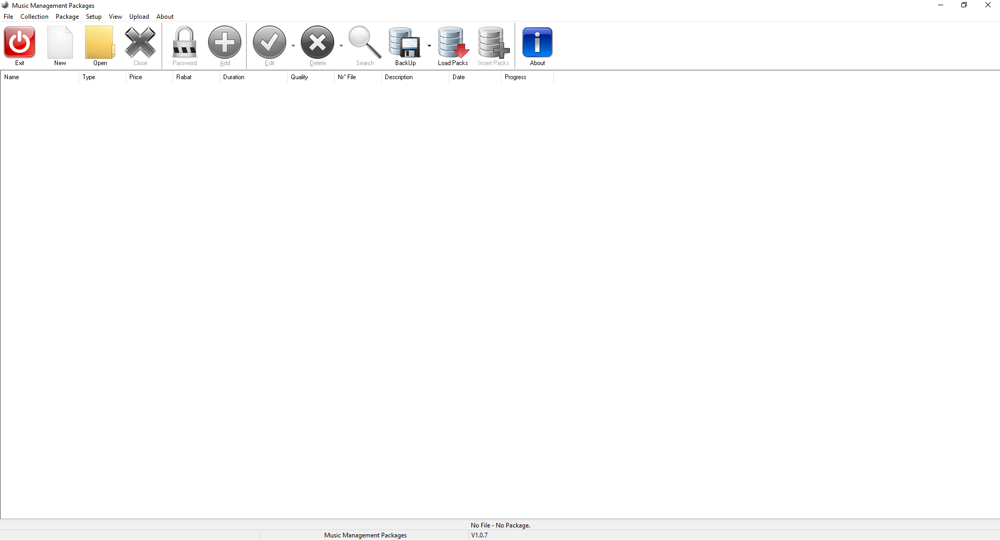
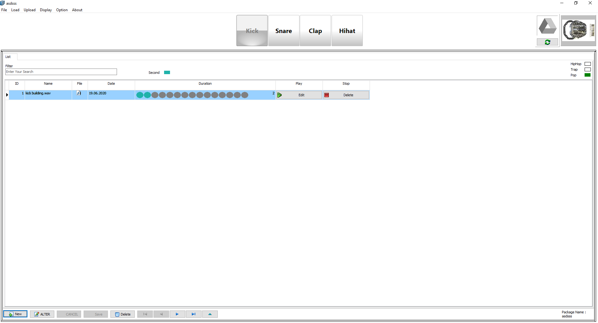
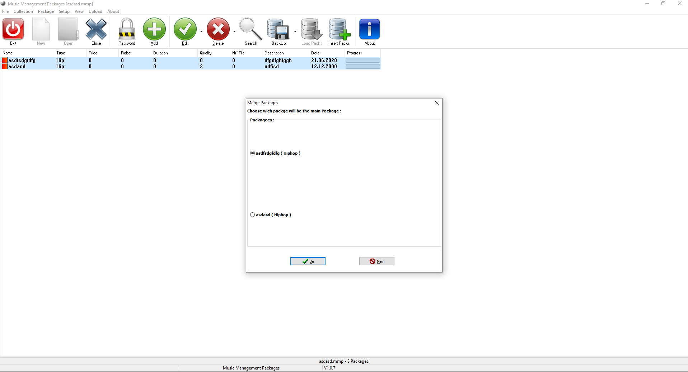
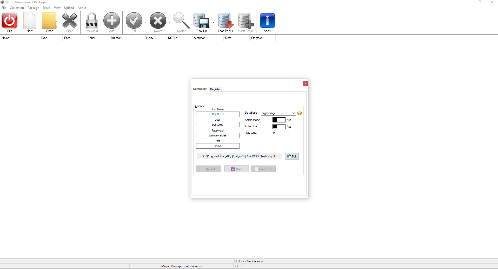
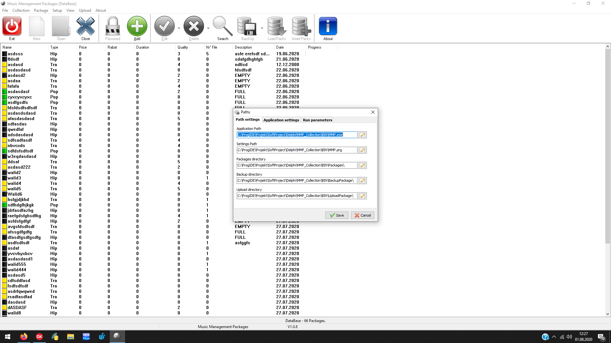
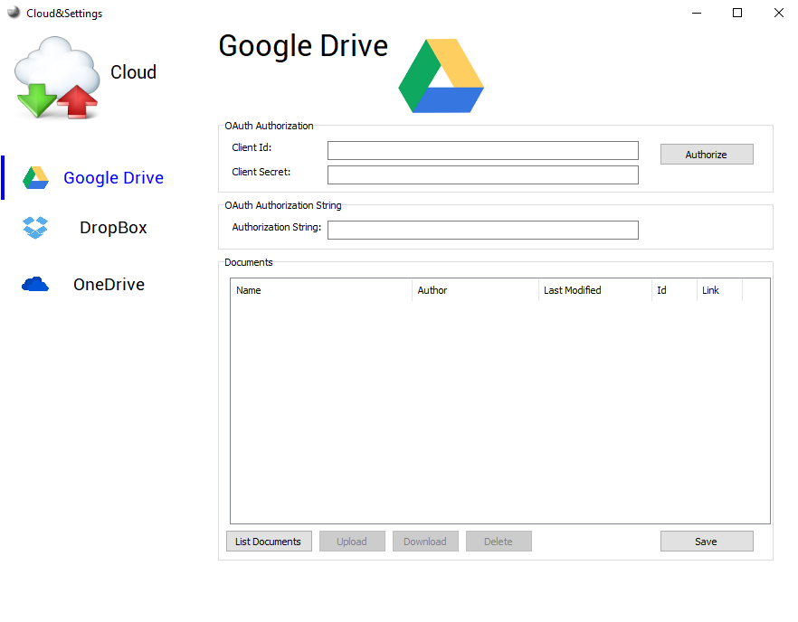

# MMP ( Desktop )
> Management Music Packages ( WAV )  | DESKTOP

# Main View

- `MMP` is a complete Software Solution for Management Music Packages Format WAV.

**Authors:**  *WalWalWalides*
------

`MMP` offers a new Way for better Creating and editing WAV packages.
It's a good Tools for music Producent to store Big number of sound.All sounds in packages is divided in different categories,so the Producer can easy found the searching Sound. 
That means granting increased Productivity - That promises more and better Work in less Time.

`MMP` simplifies service Storing and Organization, enables optimal Staffing,and you can use with different DAW ( Digital Audio Workstation) Software.

Principal Software Benefits:

      - Send and Receive Data from app

      - Flexible and Powerful User Interface.
      
      - Support database Systems  : postgreSQL.

      - Efficient Packages and resource Planning,storing.

      - Strong resource Management and capacity Planning.
      
      - Supports data access to PostgreSQL tables and views.
      
      - Automatically update by new versions are available.
      
      - View all recently opened files
      
      - Move Sound from package to another package.
      
      - Backup and Recovery.
      
      - Upload and Download packages using mainstream Cloudservices like (Google Drive,DropBox... ).
      
      - Ability to modify  and store all connection parametres related to the Cloudservices.
      
      - Auto Generate .mmp files with all specific information for every packages in a single collection.
      
      - Create a collection using all existes packages in the main database.
      
      - Merge two packages in one single package.
      
      - Ability to exchange packages with different platforms.

      - Better management of communication errors with the database.

      - Migration  of two packages in one single package.

 ## Package View 
 
   
 
 - After your create a new package ,You can store all kits Sounds bolow in four categories.

 ## Migration  
 
    
 
 - Merge two packages in one single package.this feature Help you to reduce the number of Packages By need.

 ## Communication Setting   
 
    
 
 - Setting Connection with (PostgresSQL)Database.

## Path Setting

    
 
 - Customizing Paths for delivery processing.

 ## MMP Cloud   
 
    
 
 - Upload and Download packages using mainstream Cloudservices like (Google Drive,DropBox... ).

## Contains

| Module | Name | 
| --- | --- |
|MMP.exe|Music Management Packages |

------

## To Install the Software:

### Install application (Last Version V1.0.9)
Is it better to install Postgresql before installing the application 

Download Link For Postgesql : https://www.enterprisedb.com/downloads/postgres-postgresql-downloads

Download Link For MMP : https://github.com/walwalwalides/MMP_Collection/releases/download/V1.0.9/MMP_1.0.9_Setup.exe

------
### New Features
MMP(V1.0.8) :
https://www.youtube.com/watch?v=WAyMIeGzf34

------
### Demo
How to Insert Package : 
https://www.youtube.com/watch?v=pQAahQTCvkA

Create Collection Connected to the Cloud : 
https://www.youtube.com/watch?v=vMnvHVXiIj4

How to Merge two packages :

### Documentation 
|Titel|Subject|
| --- | --- |
|[Create a Collection](https://github.com/walwalwalides/MMP_Collection/blob/master/MMP_Desktop/Help/Collection.md)| How you create a Collection. 

# If You Want To Donate!

