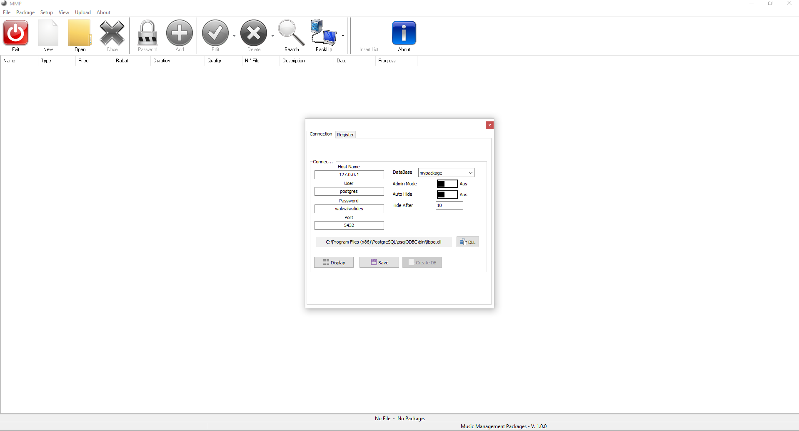

# MMP ( Desktop )

`MMP` is a complete Software Solution for Management Music Packages Format WAV.

**Authors:**  *WalWalWalides*
------

The Software offers a new Way for better Creating WAV packages. That means granting increased Productivity - That promises more and better Work in less Time.

`MMP` simplifies service Storing and Organization, enables optimal Staffing,and you can use with different DAW ( Digital Audio Workstation) Software.

Principal Software Benefits:

      - Send and Receive Data from app

      - Flexible and Powerful User Interface.

      - Efficient Packages and resource Planning,storing.

      - Strong resource Management and capacity Planning.
      
      - Supports data access to PostgreSQL tables and views.
      
      - Automatically update by new versions are available.
      
      - View recently opened files.
      
      - Move Sound from package to another package.
      
      - Backup and Recovery.
      
      - Upload and Download packages using mainstream Cloudservices like (Google Drive,DropBox... ).
      
      - Ability to modify  and store all connection parametres related to the Cloudservices.
      
      - Auto Generate .mmp files with all specific information for every packages in a single collection.
      
      - Create a collection using all existes packages in the main database.

 ## MMP Cloud   
 
    

## Contains

| Module | Name | 
| --- | --- |
|MMP.exe|Music Management Packages |

------

## To Install the Software:

### Install application (Last Version V1.0.6)
Is it better to install Postgresql before installing the application 

Download Link For Postgesql : https://www.enterprisedb.com/downloads/postgres-postgresql-downloads

Download Link For MMP : https://github.com/walwalwalides/MMP_Collection/releases/download/V1.0.6/MMP__Setup.exe

------

### Demo
How to Insert Package : 
https://www.youtube.com/watch?v=pQAahQTCvkA

# If You Want To Donate!

