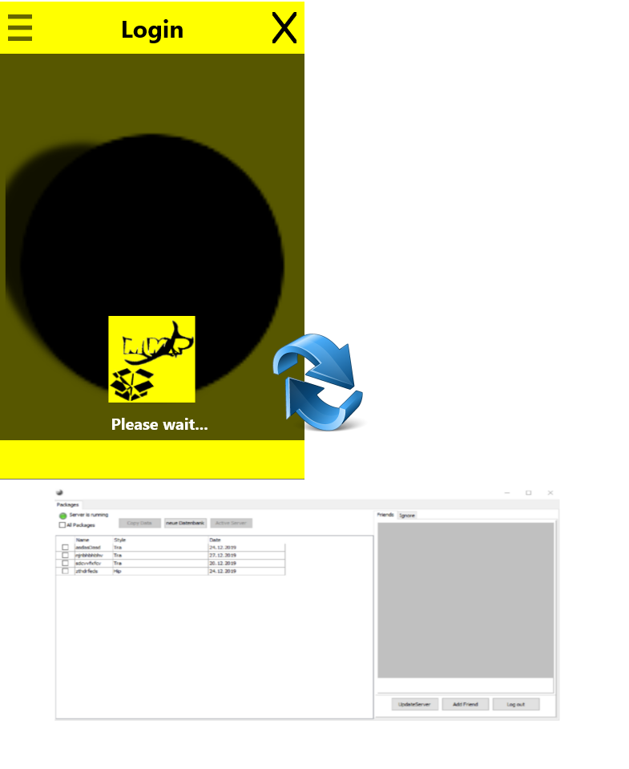

# MMP_Collection

- Management Music Packages ( WAV )  | ANDROID & DESKTOP
                         

                                

   

------
**Authors:**  *WalWalWalides*
------

The Software offers a new Way for better Creating and editing WAV packages.
It's a good Tools for music Producent to store Big number of sound.All sounds are divided in different categories,so the Producer can easy found the searching Sound. 

`MMP` increase Productivity - That is mean more and better Work in less Time.
With help this software,the producer can create his own Collection and exchange it with another producer throught the Cloud store like ( Google Drive,DropBox ...).

`MMP` simplifies service Storing and Organization, enables optimal Staffing,and offer the ability to combine the software with your choosed DAW software ( Digital Audio Workstation) .

## Contains

| File | Contents | 
| --- | --- |
| .gitignore | Git ignores the Files in this File |
|[MMP_Desktop](https://github.com/walwalwalides/MMP_Collection/blob/master/MMP_Desktop)| Software Solution for Management Music Packages Format WAV.
|[MMP_Mobile](https://github.com/walwalwalides/MMP_Collection/tree/master/MMP_Mobile)| Android Data Transfer Apps to Switch Packages Easily.
| README.md | The Readme for this Project|

------

## Software Development Process
- [All Integrate Features](https://github.com/walwalwalides/MMP_Collection/blob/master/New_Feautres_Version.md) 
------

# If You Want To Donate!

